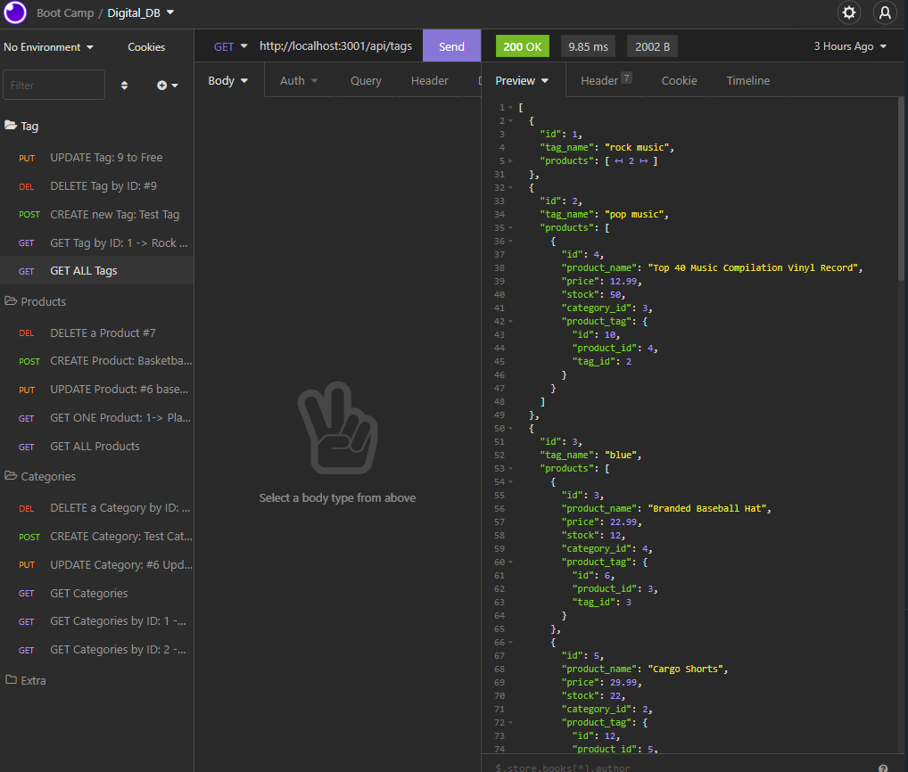

# Digital_DB
---

  
  
   
   
   
   
   
## Description

This project provides a backend for an ecommerce website.

---
  ## Table of Contents

  [Features](#features)

  [Screenshot](#screenshot)

  [Installation](#installation)
    
  [Usage](#usage)
    
  [License](#license)
    
  [Contributing](#contributing)

  [Questions](#questions)
  
  

---

## Features

      1. Uses Express.js 

      2. Uses Sequelize 

      3. Uses dotenv 

      4. Uses MySQL 
---

## Screenshot 
  

   [Here is a link to a video showing me using Digital DB  to manipulate the database of a fictional store.](https://watch.screencastify.com/v/J5yaNUPIoCjH1iwS0yFf)
  
  

  ---

  ## Installation

      1. Clone the repository 

      2. Type npm install 
---
  ## Usage

      1. From MySQL prompt type: source db/schema.sql 

      2. For seeded DB type npm run seed 

      3. To run type npm start 

  ---
  ## License 

  &emsp; 

      To read about the license of this project click the link below.

  &emsp;[License](https://github.com/tgtiburon/Digital_DB/blob/main/LICENSE) 

  ---
  ## Contributing

      1. Email me, or leave a message on the issue tracker. 

---
## Questions

If you have any questions about this project feel free to email me at <tg.tiburon@gmail.com>.  

To see the rest of my portfolio, visit [Github](https://github.com/tgtiburon).

Below is a graphic displaying my most used languages on github.

This Readme file was created with Readme Architect by Tony Gendreau &copy;
