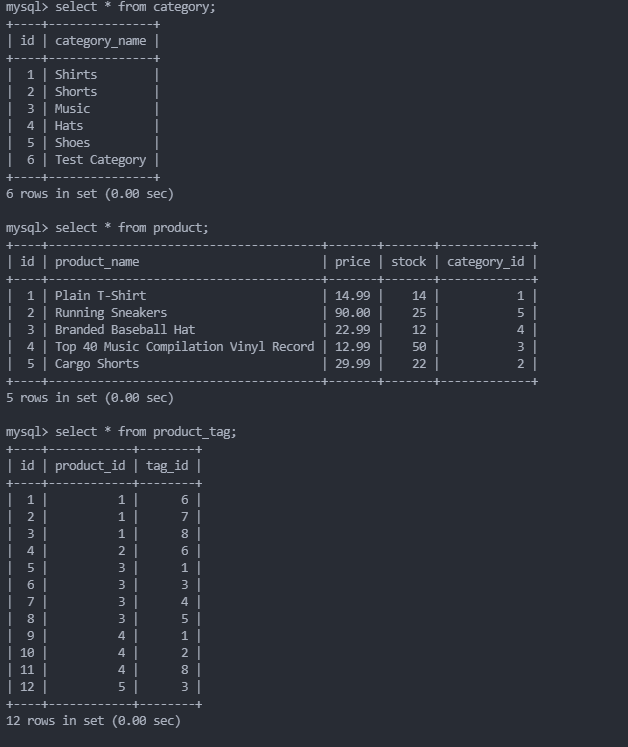
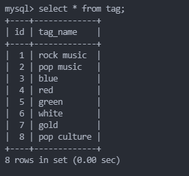

# Digital_DB

Video of app in action:

## User Story
AS A manager at an internet retail company
I WANT a back end for my e-commerce website that uses the latest technologies
SO THAT my company can compete with other e-commerce companies

## Acceptance Criteria

- [] GIVEN a functional Express.js API
WHEN I add my database name, MySQL username, and MySQL password to an environment variable file
THEN I am able to connect to a database using Sequelize

- [x] WHEN I enter schema and seed commands
THEN a development database is created and is seeded with test data

- [x] WHEN I enter the command to invoke the application
THEN my server is started and the Sequelize models are synced to the MySQL database

- [] WHEN I open API GET routes in Insomnia for categories, products, or tags
THEN the data for each of these routes is displayed in a formatted JSON

- [] WHEN I test API POST, PUT, and DELETE routes in Insomnia
THEN I am able to successfully create, update, and delete data in my database

## Getting Started:

- [x] Use MySQL2 and Sequelize to connect to Express.js API.  Use dotenv to hide credentials

- [x] Use schema.sql in the db folder to create your db using MySQL shell commands

- [x] Schema -- 4 Models

            1. Category
                id- integer, doesn't allow null, set as primary_key, uses auto increment
                category_name- string, does not allow null values

            2. Product 
                id-integer, no null values, set as primary key, auto incr.
                product_name- string, no null, 
                price - decimal, no null, validates the value is a decimal
                stock- integer, no null, default value of 10, validates value is numeric
                category_id - integer, references the category model's id

            3. Tag
                id- integer, no null, set as primary key, auto incr.
                tag_name- string

            4. ProductTag
                id- integer, no null, set as primary, auto incr. 
                product_id- integer, references the product model's id
                tag_id - integer, references the tag model's id
            

- [] Associations:  Will need association methods on Sequelize models to create the following relationships
            1. Product belongs to Category, as a category can have multiple products but a product can only belong to one category.
            2. Category has many Product models.
            3. Product belongs to many Tag models. Using the ProductTag through model, allow products to have multiple tags and tags to have many products.
            4. Tag belongs to many Product models.

            HINT: Make sure you set up foreign key relationships that match the column we created in the respective models.

- [] Fill out the API Routes to Perform RESTful CRUD operations
            1. Fill out the unfinished routes in product-routes.js, tag-routes.js, and category-routes.js to perform create, read, update, and delete operations using your Sequelize models.

            NOTE: The functionality for creating the many-to-many relationship for products is already done for you.

            HINT: Be sure to look at your module project's code for syntax help and use your model's column definitions to figure out what req.body will be for POST and PUT routes!

- [x] Seed the database
            1. After creating the models and routes, run npm run seed to seed data to your database so that you can test your routes.

- [x] Sync Sequelize to the database on server start
            1. Create the code needed in server.js to sync the Sequelize models to the MySQL database on server start.

## Grading Requirements

- [ ] This Challenge is graded based on the following criteria:

## Deliverables: 10%
- [ ]   Github repo containing code.

## Video Walkthrough: 37%

- [ ] A walkthrough video that demonstrates the functionality of the e-commerce back end must be submitted, and a link to the video should be included in your README file.

- [ ] The walkthrough video must show all of the technical acceptance criteria being met.

- [ ] The walkthrough video must demonstrate how to create the schema from the MySQL shell.

- [ ] The walkthrough video must demonstrate how to seed the database from the command line.

- [ ] The walkthrough video must demonstrate how to start the application’s server.

- [ ] The walkthrough video must demonstrate GET routes for all categories, all products, and all tags being tested in Insomnia.

- [ ] The walkthrough video must demonstrate GET routes for a single category, a single product, and a single tag being tested in Insomnia.

- [ ] The walkthrough video must demonstrate POST, PUT, and DELETE routes for categories, products, and tags being tested in Insomnia.

## Technical Acceptance Criteria: 40%
- [ ] Uses MySQL2 and Sequelize

- [ ] Uses dotenv

- [ ] Syncs Sequelize models to a MySQL database on server start

- [ ] Includes column definitions for all four models outlined in the Challenge instructions

- [ ] Includes model associations outlined in the challenge instructions

- [ ] 

## Repository Quality: 13%
- [ ] Repository has a unique name.

- [ ] Repository follows best practices for file structure and naming conventions.

- [ ] Repository follows best practices for class/id naming conventions, indentation, quality comments, etc.

- [ ] Repository contains multiple descriptive commit messages.

- [ ] Repository contains quality README file with description, screenshot, and link to deployed application.

## How to Submit the Challenge
- [ ] You are required to submit BOTH of the following for review:

- [ ] A walkthrough video demonstrating the functionality of the application and all of the acceptance criteria being met.

- [ ] The URL of the GitHub repository. Give the repository a unique name and include a README describing the project.